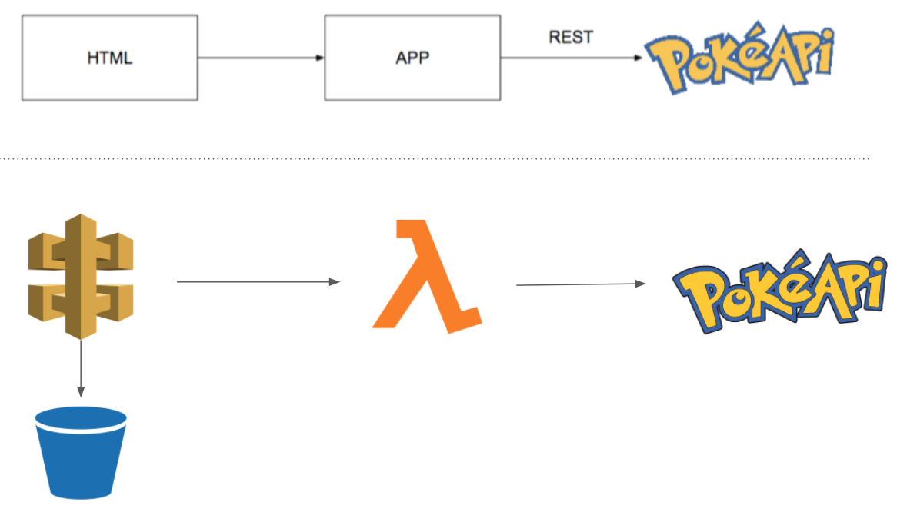

# pulumi-aws-js-api-poke

Aplicacion busqueda de pokemones basada en Api: https://pokeapi.co/ 
## Comenzando 🚀

- Desarrollado en Node.js
- Deploy en AWS
- Insfraestructura construida con Pulumi
- Test con Mocha
- Front Basico(Html,CCS,Jquery)

Mira **Deployment** para conocer como desplegar el proyecto.

Organizacion de Archivos

```
pokeapi
│   index.js
│   package.json
│   pulumi.yaml
│
└───app
│   │   services.js
│   
└─── Test
│   │   test.js
│
└───www
    │   404.png
    │   favicon.ico
    │   favicon.png
    │   index.html
    │   sticky-footer...
```
### Arquitectura ⛺ 




### Pre-requisitos 📋🔧

Node.js
```
node -v
v10.16.3 
# o superior
```
Pulumi (mac)
```
brew install pulumi
```
otros sistemas: https://www.pulumi.com/docs/get-started/install/

AWS

Cuenta en AWS y Clave de acceso CLI

Exportar 

```
export AWS_ACCESS_KEY_ID=<>
export AWS_SECRET_ACCESS_KEY=<>
```

Mocha


## Ejecutando las pruebas ⚙️
```
cd pokeapi
npm test
```


## Despliegue 📦

```
cd pokeapi
pulumi up
```
## Construido con 🛠️

_Menciona las herramientas que utilizaste para crear tu proyecto_

* [Pulumi](http://www.dropwizard.io/1.0.2/docs/) - El framework de infraestructura como codigo
* [Node.js](https://maven.apache.org/) - Runtime
* [AWS](https://rometools.github.io/rome/) - Cloud

## Autor ✒️

Oscar Cortes 

@olcortesb

## Licencia 📄

Este proyecto está bajo la Licencia GNU v3 - mira el archivo [LICENSE.md](LICENSE.md) para detalles

## Expresiones de Gratitud 🎁

Como siempre... a la familia!
Por prestarme tiempo de su tiempo!

---